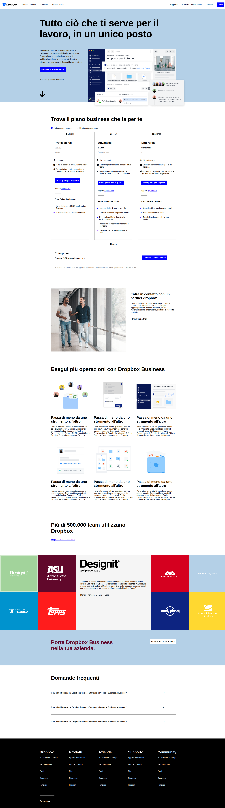

# Replica Dropbox - HTML & CSS

<a href="https://aledibernardo.github.io/htmlcss-dropbox/">Visualizza il progetto</a>

**Descrizione**
Questa è una replica della pagina di presentazione di Dropbox Business, realizzata interamente in HTML e CSS. L'obiettivo è ricreare fedelmente il design e la struttura dell'originale, focalizzandosi sull'aspetto visivo e sulla comunicazione dei principali vantaggi del prodotto.

**Caratteristiche Principali**
* **Layout:** Replica accurata del layout dell'originale, con un'attenzione particolare alla disposizione degli elementi e all'utilizzo dello spazio.
* **Tipografia:** Utilizzo di font simili a quelli dell'originale per garantire una coerenza visiva.
* **Colori:** Adozione della stessa palette cromatica per trasmettere la stessa identità di marca.
* **Immagini:** Utilizzo di immagini placeholder per simulare il contenuto originale.
* **Responsività:** Visualizzazione ottimale su dispositivi desktop.

**Tecnologie Utilizzate**
* **HTML5:** Struttura della pagina.
* **CSS3:** Stili e layout.

### Immagine dimostrativa
